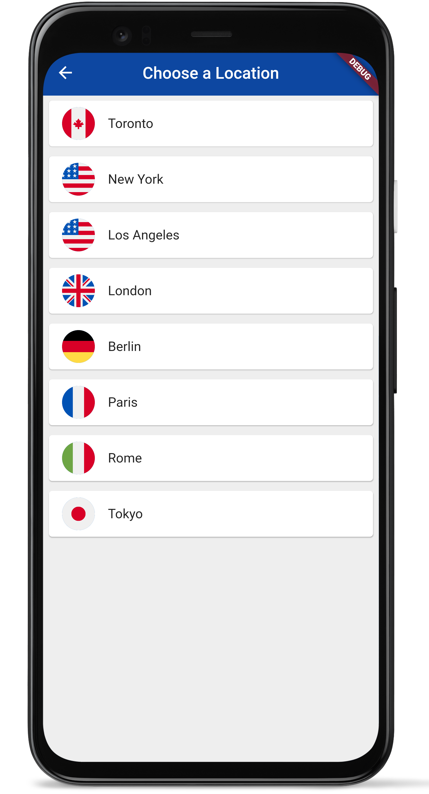
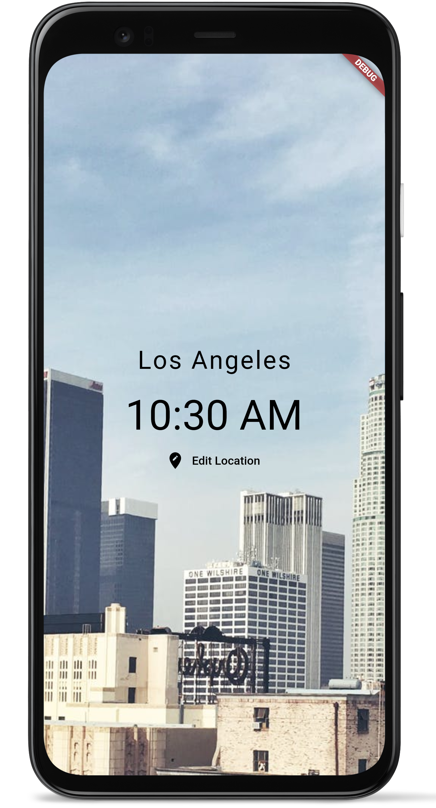
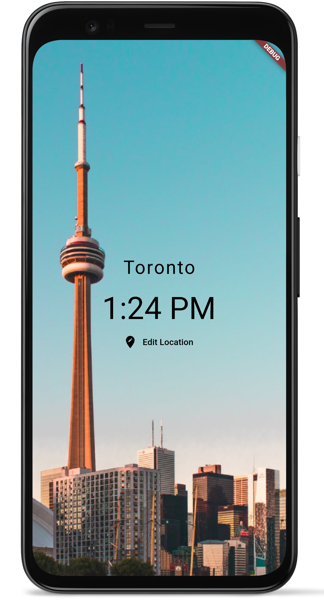
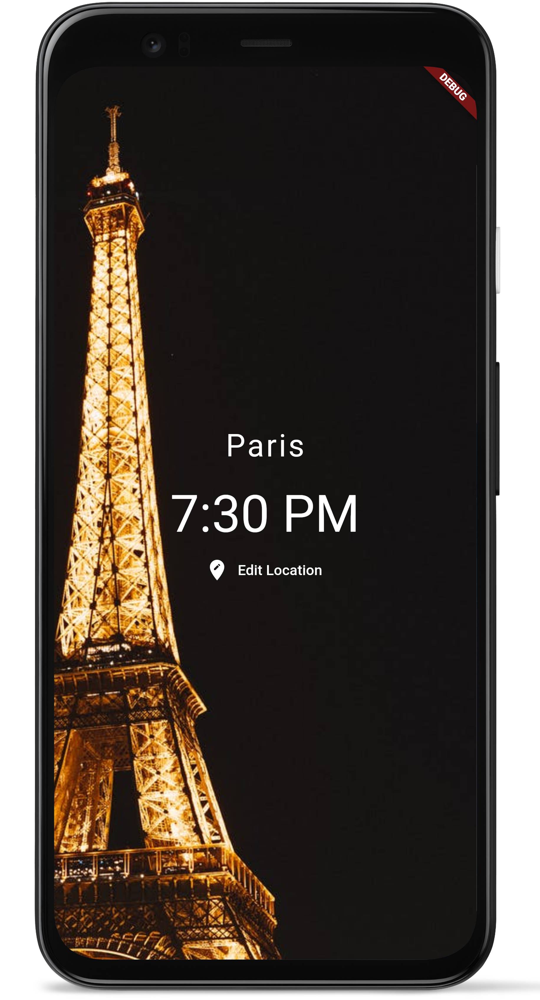

# World Time App

A flutter app for seeing time of cities all around the world!

Users are able to select from list of cities to see a city's time time and depending on if it is daytime or nightime there, they will see a different image

To download this application - <a href="https://github.com/anthonycandelino/world_time/archive/master.zip">Click here</a> 

<h2> Screenshots of App</h2> 

  
  
  
  

